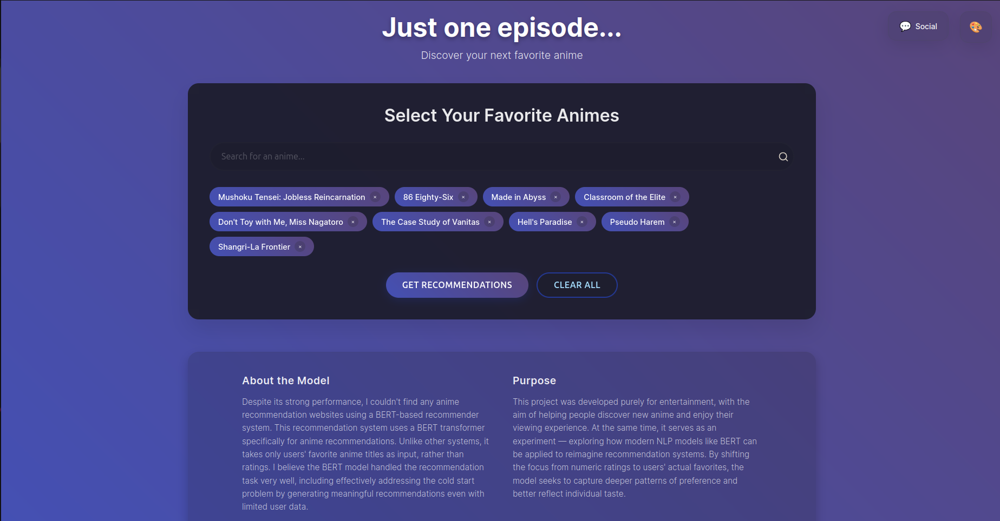
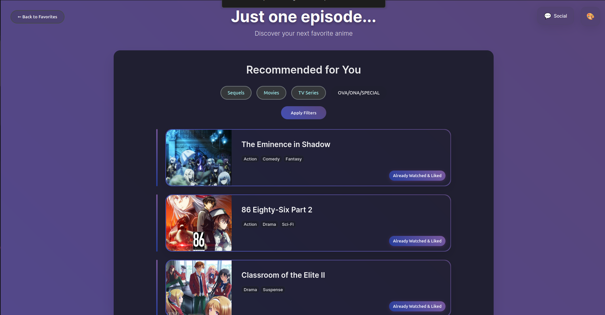

# AnimeRecBERT: BERT-Based Anime Recommendation System

**AnimeRecBERT** is a personalized anime recommendation system based on BERT transformer architecture. Adapted from [https://github.com/jaywonchung/BERT4Rec-VAE-Pytorch](https://github.com/jaywonchung/BERT4Rec-VAE-Pytorch), this project introduces customizations tailored for an anime recommendation system and inference.

- ⚙️ **Hybrid Model with Genre Embeddings** — Added genre-based embeddings to enrich BERT inputs with auxiliary item metadata.
- ⚙️ **No Positional Encoding** — Removed positional encoding due to lack of temporal signals in the dataset.
- 🎌 **Anime-Specific User-Item Dataset** — Built on a large-scale dataset tailored for anime recommendations.
- **Kaggle Train and Inference Notebooks** available
- **Huggingface Space** available

### Kaggle Inference & Interactive Recommender
https://www.kaggle.com/code/ramazanturann/animerecommenderbert-inference

### Kaggle Train
https://www.kaggle.com/code/ramazanturann/animerecommenderbert-train

### Huggingface Space
https://huggingface.co/spaces/mramazan/AnimeRecBERT

This project provides a solid foundation for further development in personalized anime recommendation using transformer-based models.

## Metrics
The model was trained on a large-scale dataset containing 1.77 million users and 148 million ratings. Although positional encoding was removed, the results remain very close to those of the original BERT4Rec repository.
Below are the Top-K recommendation metrics:

<table>
<tr>
<td>

| Metric       | Value     |
|--------------|-----------|
| Recall@100   | 0.99996   |
| NDCG@100     | 0.7811    |
| Recall@50    | 0.9976    |
| NDCG@50      | 0.7807    |
| Recall@20    | 0.9863    |
| NDCG@20      | 0.7784    |
| Recall@10    | 0.9593    |
| NDCG@10      | 0.7714    |
| Recall@5     | 0.8996    |
| NDCG@5       | 0.7518    |
| Recall@1     | 0.5716    |
| NDCG@1       | 0.5716    |

</td>
</tr>
</table>

## Setup & Usage
### Clone Repo

```bash
git clone https://github.com/MRamazan/AnimeRecBERT-Hybrid
cd AnimeRecBERT-Hybrid
```

###  Create & Activate venv
#### For Linux
```
python3 -m venv venv
source venv/bin/activate 
```

#### For Windows
```
python -m venv venv
venv\Scripts\activate 
```


### Download Dataset & Pretrained Model

#### For Linux
```bash
mkdir -p Data/AnimeRatings

curl -L -o Data/AnimeRatings/animeratings.zip \
     https://www.kaggle.com/api/v1/datasets/download/ramazanturann/user-animelist-dataset

unzip Data/AnimeRatings/animeratings.zip -d Data/AnimeRatings/
```

#### For Windows
```bash
mkdir Data\AnimeRatings

kaggle datasets download -d ramazanturann/user-animelist-dataset -p Data\AnimeRatings

Expand-Archive -Path "Data\AnimeRatings\user-animelist-dataset.zip" -DestinationPath "Data\AnimeRatings" -Force
```

### Install Requirements
Install PyTorch from https://pytorch.org/get-started/locally/
```bash
pip install -r requirements.txt
```

```bash
# Preprocess takes up to 30 minutes
# To avoid this, this script will move the dataset.pkl and negative samples file to preprocessed folder
python move_files.py         
```

### Run Local Host

```bash
!python main_local.py \
  --checkpoint-path Data/AnimeRatings/pretrained_bert.pth \
  --dataset-path Data/preprocessed/AnimeRatings_min_rating7-min_uc10-min_sc10-splitleave_one_out/dataset.pkl \
  --animes-path Data/animes.json \
  --images-path Data/id_to_url.json \
  --mal-urls-path Data/anime_to_malurl.json \
  --type-seq-path Data/anime_to_typenseq.json \
  --genres-path Data/id_to_genres.json
 
```

### Train Code 
You can set parameters in templates.py file
```bash
# This script will train, validate and test the model.
python main.py  --template train_bert             
```

# Results
## My Favorites (Input for Inference)

| #  | Anime Title                                                                |
|----|----------------------------------------------------------------------------|
| 1  | Youkoso Jitsuryoku Shijou Shugi no Kyoushitsu e                            |
| 2  | Giji Harem                                                                 |
| 3  | Ijiranaide, Nagatoro-san                                                   |
| 4  | 86 (Eighty-Six)                                                            |
| 5  | Mushoku Tensei: Isekai Ittara Honki Dasu                                   |
| 6  | Made in Abyss                                                              |
| 7  | Shangri-La Frontier: Kusoge Hunter, Kamige ni Idoman to su                 |
| 8  | Vanitas no Karte                                                           |
| 9  | Jigokuraku                                                                 |

## Recommendations Based on My Favorites
**Note:** The *position of favorites does not affect inference results*, as the model uses only the presence of items (not sequence).

## Top Anime Recommendations for Me

| Rank | Anime Title                                                               
|------|------------------------------------------------------------------------------
| #1   | The Eminence in Shadow                                                    |
| #2   | 86 Eighty-Six Part 2                                                     |
| #3   | Classroom of the Elite II                          | 
| #4   | Mushoku Tensei: Jobless Reincarnation Part 2                                                     | 
| #5   | The Eminence in Shadow Season 2                                                       |
| #6   | Mushoku Tensei: Jobless Reincarnation Season 2                                                            |       
| #7   | Call of the Night                                                        |     
| #8   | Re:ZERO -Starting Life in Another World- Season 3                                                            |      
| #9   | Mushoku Tensei: Isekai Ittara Honki Dasu Part 2                       |    
| #10  | Mushoku Tensei: Jobless Reincarnation Season 2 Part 2                              |   
| #11  | My Dress-Up Darling                       |
| #12  | Alya Sometimes Hides Her Feelings in Russian            |    
| #13  | Summer Time Rendering                                                     |    
| #14  | Heavenly Delusion                     |     
| #15  | Re:ZERO -Starting Life in Another World- Season 2 Part 2                                                |   
| #16  | Vinland Saga Season 2                                    |   
| #17  | Lycoris Recoil                                                              |      
| #18  | [Oshi No Ko]                                                        |
| #19  | [Oshi No Ko] Season 2                                            |
| #20  | Frieren: Beyond Journey's End                                         |


### ✅ Evaluation: How Good Are the Recommendations?

Out of the Top 20 recommendations, **11 titles** were already in my completed/favorites list — showing strong personalization performance.
Most of the recommendations were sequels to my favorites, which shows BERT's capacity for data integrity and contextual awareness.


| Watched & Liked? ✅ | Title                                                                  |
|---------------------|------------------------------------------------------------------------|
| ✅                  | 86 Eighty-Six Part 2                            |
| ✅                  | Classroom of the Elite II                      |
| ✅                  | Mushoku Tensei: Jobless Reincarnation Part 2            |
| ✅                  | Mushoku Tensei: Jobless Reincarnation Season 2                                              |
| ✅                  | Mushoku Tensei: Isekai Ittara Honki Dasu Part 2                                                           |
| ✅                  | Mushoku Tensei: Jobless Reincarnation Season 2 Part 2                                                                |
| ✅                  | My Dress-Up Darling                                                              |
| ✅                  | Alya Sometimes Hides Her Feelings in Russian                                                          |
| ✅                  | Heavenly Delusion                                                             |
| ✅                  | [Oshi No Ko]                                                |
| ✅                  | Frieren: Beyond Journey's End                                                |

## Images





